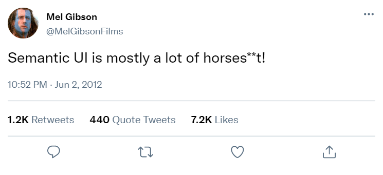

One of my first forays in computer science was web design when I was a kid.  As an eutrepuneureal twelve year old I made cash making websites for my Dad and his friends.  I did everything from law firms to vacation rentals to gasoline powered blenders with motorcycle handlebars (yes you read that correctly). This is how I wsa able to get my first custom surfboard by 14. Of course, all of my websites were handwritten in HTML in Notepad, with outdated 

 tags and image maps.  At one point <frames> came out and I just felt so sleek and cool, I was unstoppable.  Then one day those cool looking websites no longer looked cool and I didnt understand why. Also I could no longer click the view source and understand what was going on behind the scenes on other webpages.  The tags they were using made no sense and didn’t work when I tried to use them.  The internet had surpassed me and I felt destined to live the sidelines of web design forever.

Well this last two weeks all of that changed with one word, Frameworks, or wait maybe two words Semantic UI? Does that count as three words now? Frameworks are a thing and Semantic UI a thing, and CSS is probably a thing as well, and just like my giant Greek family I know they are all closely related but I can't always explain exactly how.
Yet somehow despite that lack of precise knowledge I am now able to create a professional looking website in the time it takes to complete a WOD (or BWOD).  Now when I browse the web I can see through the matrix like Neo, and I can see exactly what I would do if I had to remake their webpage.  
  
In class last week, when we had to choose a website to recreate, many students chose to recreate websites that I thought were much too nice to be done by amateurs like us.  I thought there was no way we could make a site of that quality.  Well this is one of the few times in life you will hear me say I was wrong.  Every student I saw posted a very nice replica of their site to the class discord channel. I was genuinely impressed with everyone, including myself.  During the design process there were so many times I didn't know if I was on the site I had created, or if I was on the actual Summit Ice website.  

It happened so fast that I didn't even know I knew how to do this stuff.  It turns out Frameworks is an incredible tool in that way.  I am still realizing the potential and learning more every time I use it.  Honestly I had very little interest in web design when I was initially learning this, I wanted to do real programming with loops and variables, but now I have been reintroduced to a world of web design, and I can now make a site look as good as most of the nicer ones out there.  More than just copying existing sites like we do for class I am now looking for sites that need a facelift and seeing if I can do a better one.  Now I am sure Keoki put his heart and soul into his website with image map just like I once did, but I think I can do a better job now, maybe if Keoki wants to take me scuba diving he can have the source code.

Keoki's site -> <a ref="https://www.keokiscuba.com/">https://www.keokiscuba.com/</a>
  
My site -> <a ref="http://www.manoaweb.byethost3.com/KeokiScuba/">http://www.manoaweb.byethost3.com/KeokiScuba/</a>

In conclusion Frameworks has given me about a 20 year update to my web design in a matter of 2 weeks.  Maybe once again I will be getting surfboard money from webdesign like I once did as a kid.  My sites are again as sharp and sleek as when I learned to do HTML4 frames in the early 2000s.  My websites are contemporary and clean, color blocked and themed, it’s like art is meeting computer science and I kind of like it.  After this module and learning what an amazing tool Frameworks and Semantic UI is, I will never be able understand how people like Mel Gibson could say things that are antiSemantic.
 
See how far we’ve come, relics of the interweb:
  
  Texas Internet Consulting - <a ref="http://tic.com/index.html"> http://tic.com/index.html </a> - HTML1.0 1987
  
Dole/Kemp Campaign - <a ref="http://www.dolekemp96.org/main.htm"> http://www.dolekemp96.org/main.htm </a> - 1996
  
Welcome to Netscape - <a ref="http://home.mcom.com/home/welcome.html/"> http://home.mcom.com/home/welcome.html </a> -1995
  

2021-10-07
