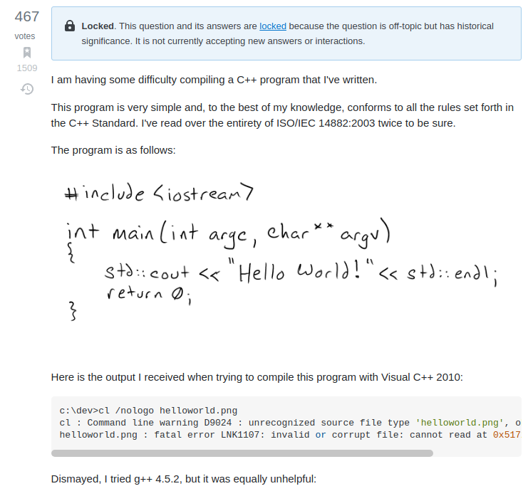
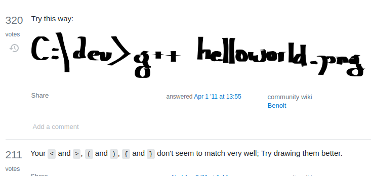
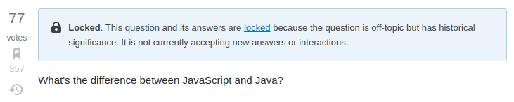
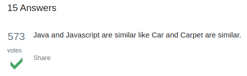

Questioning how to Question

Ever hear there is no such thing as a dumb question?  Well that might not be entirely true.  According to an article called How to ask questions the smart way by Eric Raymond, there are not only dumb questions but smart questions as well.  To make matters worse asking dumb questions might even make you a loser to the mysterious online community called “Hackers”. Eric describes this elite society of the knowing as Hackers and tells you how they can aide you in your cyber-struggles if you can unlock their secret language.

These Hackers are knowledgeable, but as sharp tongued as they are smart.  They will shatter your ego if you as in an incorrect way, but will go to great lengths to help if they deem your question worthy.  So how can you avoid being a loser and asking the wrong question?  Well much of that comes down to etiquette.  Don’t seem arrogant, and full of yourself.  You must demonstrate that you tried your hardest to find a solution and that you are not just being lazy.  These hackers are not a technical support hot line, they have no obligation to help you, but they also remember what it was like to learn and will help you if you show the effort.

In addition to showing effort, you should always appreciate the help.  Don’t just bail after your question is answered, at the very least let everyone know  what your problem was and what solved it.  Nobody likes reading posts only to gain no answer.  Let everyone know what worked and give credit to the people who helped you.  They will likely be the same people reading answering your questions in future posts.    I know I have made this mistake more than once and hope to learn from this article to avoid making this mistake in the future.

Beyond just etiquette, must make it easy for them to help you.  Nobody wants to read a novel to get to your question.  You must be as brief while still providing all the pertinent information required to help you.  Be clear and concise, make it easy for these people to help you.  In this age of information you have more resources than ever to assist you in becoming a better software engineer.

A great example of this is my little brother, Jon.  He has no formal training in programming or computers, yet now works at a direct level software engineer position at several AAA game studios.  He has learned everything he knows from resources available online and became so good that he accidentally finds more programming work that he can shake a stick at.  People that know how he operates know that what makes him a truly great coder is his ability to google.  He can find the solution to any problem on the web, and that is a skill that shouldn’t be underestimated.

Lets take a look at some smart questions and not so smart questions below from Stack Overflow, and see what separates the winners from the losers.

https://stackoverflow.com/questions/5508110/why-is-this-program-erroneously-rejected-by-three-c-compilers

 

 

Here is a great example of a not so great question.  First the title “Why is this program erroneously rejected by three C++ compilers?”  It almost implies the code is fine but the compliers are the problem, which at least the compilers and errors are specified.  This question is so simple and easy to solve Im sure a quick google search would have led to an answer.  Not only was it way too simple, but the code is hand drawn! Of course this was going to “draw” some hilarious responses as well.  I’m hoping this guy’s question was a joke, but the way the errors are listed I'm not too sure.

 

 

https://stackoverflow.com/questions/245062/whats-the-difference-between-javascript-and-java

Here is another question from the not so great category, although some of the responses are wonderful.

The OP asks simply “What's the difference between JavaScript and Java?”.
 

 
Obviously a little bit of research online could answer this in a few minutes but you can tell the person was being lazy and just wanted to be spoon fed an answer.  My Favorite of which is “Java and Javascript are similar like Car and Carpet are similar.”
 

 

Now for some better questions.

https://stackoverflow.com/questions/1580596/how-do-i-make-git-ignore-file-mode-chmod-changes/1580644#1580644

How do I make Git ignore file mode (chmod) changes?

I have a project in which I have to change the mode of files with chmod to 777 while developing, but which should not change in the main repo.

Git picks up on chmod -R 777 . and marks all files as changed. Is there a way to make Git ignore mode changes that have been made to files?

I think this question is good because the title is enough to let everyone know they are looking for a simple and attainable solution that isn’t going to eat up a lot of time.  If someone knows how to do this the answer will be simple and easy, yet this is a question that has gained a lot of interest so I would imagine a lot of people have the same question and found this post helpful.  The question demonstrates knowledge and shows an effort was made to solve this problem previously.  Even better that the question is the answer.  So helpful and easy to ready.  Full of explanations with warnings with details the process.  Obviously a lot of effort went into this answer.  Now you see the information that comes when you ask the right question!

In conclusion, we have learned that not all questions are smart questions.  Smart people like a smart question, so ask a smart question and you’ll get a smart response.  Likewise ask a dumb question and get a dumb response.  Effort will be reciprocated.  The internet is a wealth of knowledge and information, you just have to have the keys to unlock it.  If you are having a problem odd are someone else has experienced and solved that problem already.  You can save a lot of time and headache if you just know how to ask the right questions.

2021-09-09
