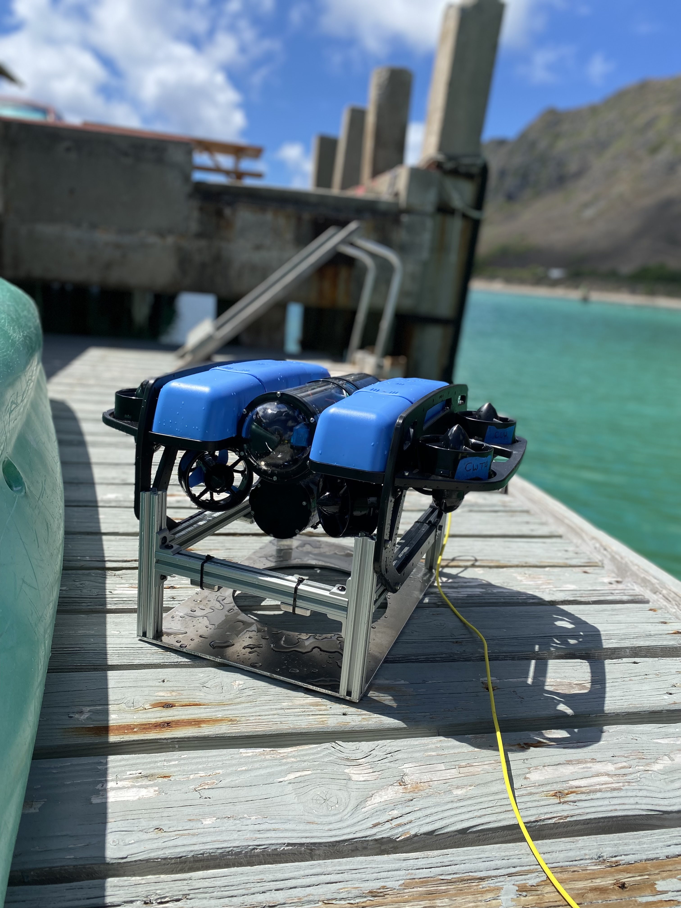
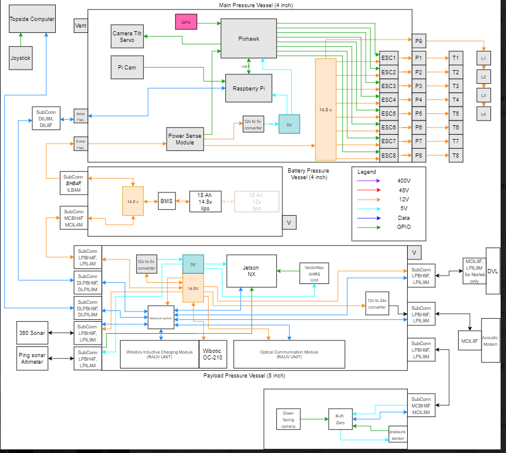
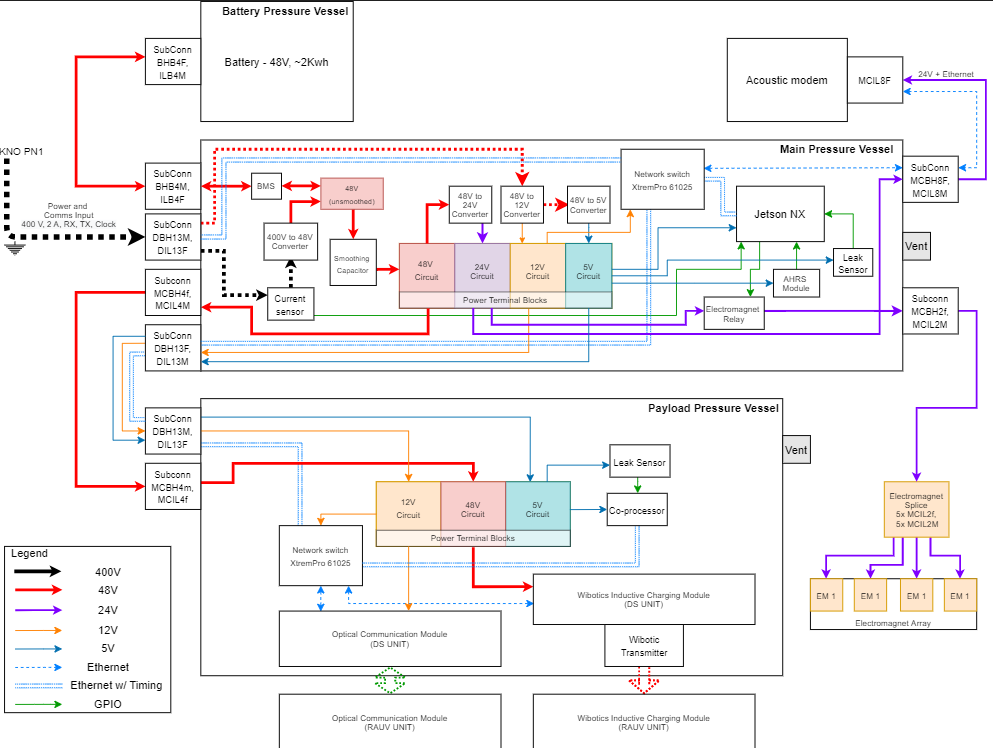

The UROP program at UH is developing a resident underwater ROV that will operate out of Kewalo basin harbor.  It will be capable of recharging itself between missions on a docking platform and secured in place my electromagnets.  Based on the Blue Robotics ROV2 this ROV will be operated remotely and wirelessly collect data about the ocean.  I am the lead Electronics Engineer and work in the lab assembing and testing the circuits for the ROV.  It is a paid position at the robotics labratory at UH Manoa, that I was interveiwed and selected for.  I work with graduate students helping them design circuits for their Dissertations.

This a great project for me as it requires constant problem solving as well as both computer science skills and electronics.  It allows me to use my experience with Arduino as well as my two Associates of Science Degrees in General and Digital Electronics.  This job requires weekly meetings, teamwork and communication.  I love this project so much I could spend all day just tinkering in the lab on this loveable little robot, as this is my true passion.  I think it utilizes my thought processes and thinking in so many ways.  

It is a very fun project that requires thinking outside the box and problem solving.  I love robotics and being able to put my education on the topic to use.  There are many obstacles to overcome on this project, such as remote operation, data transmission and corrosion.  I am working with a talented team of individuals to overcome these obstacles and am confidant we will have this fully operational in the near future.  For more a look at some of the circuits that make this bot tick check out the pictures below.  

  
   
  
