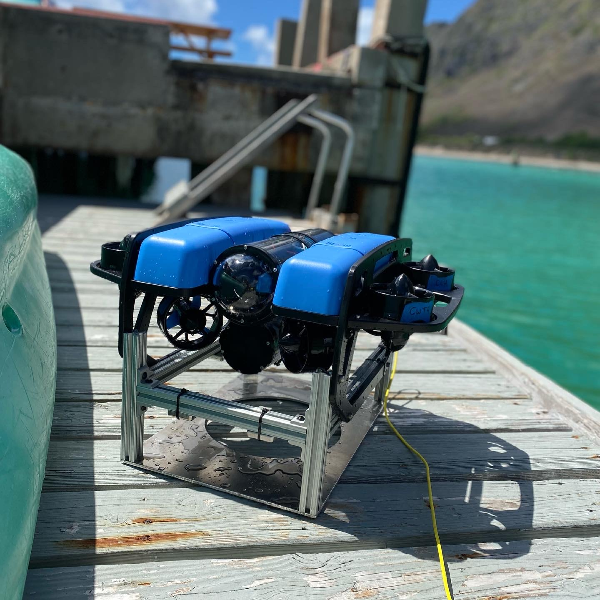

  

The UROP program at UH is developing a resident underwater ROV that will operate out of Kewalo basin harbor.  It will be capable of recharging itself between missions on a docking platform and secured in place my electromagnets.  Based on the Blue Robotics ROV2 this ROV will be operated remotely and wirelessly collect data about the ocean.  I am the lead Electronics Engineer and work in the lab assembing and testing the circuits for the ROV.  It is a very fun project that requires thinking outside the box and problem solving.  I love robotics and being able to put my education on the topic to use.  There are many obstacles to overcome on this project, such as remote operation, data transmission and corrosion.  I am working with a talented team of individuals to overcome these obstacles and am confidant we will have this fully operational in the near future.  

