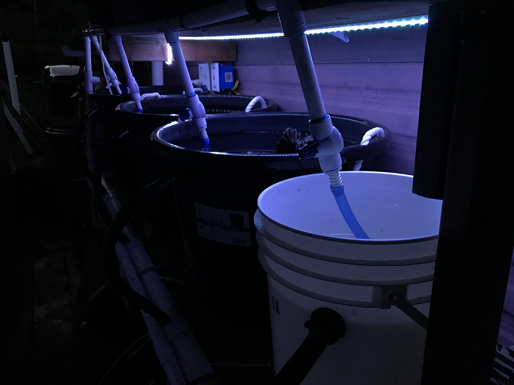

  Designed and contructed a functioning fish and shrimp room for the aquaculture of African Cichlids and Neocaridina cherry shrimp.  This project incorporated several freshwater reirculating systems for the commercial production of African Cichlids and Neocaridina cherry shrimp.  Utilized mostly recycled and repurposed materials for contruction of the room in an area between two existing structures.  It was a narrow room with over a dozen 20 gallon buckets housing breeding populations of several varieties of cherry shrimp.  Blue Diamond, Pumpkin Orange, Sakura Red, 24k yellow as well as other varieties were succefully breeding and repopulating the system as well as 4 aquariuams housing flametail african cichlids.  Water changes automatically watered several drip line aquaponic systems that grew a variety of plants and vegetation.  Water had been naturally fertalized with fish and shrimp waste createing an optimal environment for production of crops as well as automatically providing maintanence to the recirculating systems. 
