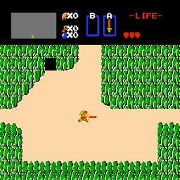

Designed a game entirely in unity.  Scripting done entirely from scratch in VSCode C# for Unity.  Complete four level game with enemies and items.  This game utilized the sprites and graphics from the original NES Zelda game to create a randomized 4 level game with complete with four unique bosses, four randomized dungeons and complete overworld.  The maps, enemies and item locations were completely randomized making for a unique gameplay experiance every play through the game.  Every dungeon contains an item key, an item, a boss key and a boss.  Each item allowed for the completion of the next dungeon.  The user could never be sure where the items were located or which direction to go.  Enemies randomly spawn in each room and health grew upon completion of every level.  Secret hidden rooms and items were locted in random locations on map, and rupees could be found and spend on conssumable items or to upgrade damage by the sword.  

This project tought me so much about completeing a project, and the fact that I wanted a working version for my brother's birthday gave me a deadline with its own crunch week.  Ultimately I was able to release the game to my brother, and I thought it worked perfectly, but he found a glitch that he was able to exploit with one of the weapons.  He found that by casting fire multiple times he could spawn mulitple items upon their death.  He even used it to spawn extra container hearts at the end of a level which ended up breaking the mechanic that completed the game so the game never detected him beating the last boss.  This taught me able beta testing, updates and downloadable content as well.  Once I fixed the glitch the game worked great and still remains unbeaten.

Project took several months to complete, and a full playable game was released after several updates.  This was one of the first leaps into programming I took.  The project started with watching a few YouTube videos, next thing I knew I was 30 videos in on a series of 100 videos.  At some point I was able to learn enough to make it my own and I could do everything I needed without watching videos.  This project was a great experiance I still value today.  Just to make things better there is still an unclaimed Amazon giftcard at the end of my game.
